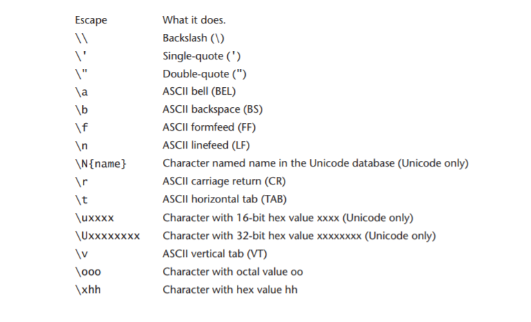

# Tips and Tricks
This docuemnt contains some useful tips and tricks that can help you writer better (or at least more pythonic) code.

## Escape characters


## String formatting
Python offers many different ways to format strings, all the methods below achieve the same output.

```python
fname = 'Bob'
lname = 'Smith'

print('My name is %s %s.' % (fname, lname))
print('My name is %(fname)s %(lname)s.' % {'fname': fname, 'lname': lname})

print('My name is {} {}.'.format(fname, lname))
print('My name is {fname} {lname}.'.format(fname=fname, lname=lname))

print(f'My name is {fname} {lname}.')
```

## List comprehension
Used to generate lists and dictionaries with less code

```python
numbers =[i for i in range(11)]
squares = [i**2 for i in numbers]
```

## Lamda functions
Used to create inline functions, which is useful when no full-sized function is needed.

```python
x = lambda a, b: a * b
print(x(4, 5))
```

Test if a value is above a certain threshold:

```python
check_value = lambda x: x > 1
check_value(0.7)	#returns False
check_value(1.3)	#returns True
```

## Assign multiple variables to the same value
Assigns all three variables `a`, `b` and `c` to the value 5.

```python
a = b = c = 5
```

## Assign values from a ordered list
All items of a list can be assigned to variables, if there are the same amount of variables.  
In this example all list elements get assigned to the provided variables, from left to right, respectively.

```python
colors = ['red', 'blue', 'green', 'yellow']
firetruck, water, flower, sun, = colors
```

After executing this snippet, the variables have the following values.

```python
firetruck = 'red'
water = 'blue'
leaf = 'green'
flower = 'yellow'
```

## Ternary conditions
Short `if-else` statements can be replaced with ternary conditions.

```python
if a:
    x = 1
else:
    x = 2

# becomes
x = 1 if a else 2
```

## `args` and `kwargs`
In Python, `args` and `kwargs` allow functions to take an unspecified amount of input values.

```python
def print_args(*args):
    for item in args:
        print(item)

print_args(12, 'Hello World', 2.4)

def print_kwargs(**kwargs):
    for key, value in kwargs.items():
        print(key, value)

print_kwargs(id_1=10, id_2="Hello World")
```

## Working with large numbers
When working with large numbers it can be useful to highlight every third position.

```python
num1 = 10000000
num2 = 10_000_000   # these are the same

print(f'{num2:,}')   # inserts a , every 0 zeroes
```

## Looping over multiple lists at once
To loop over multiple lists with one `for` loop, use the `zip` function. It stops as soon as the shortest list is exhausted.
To process all lists regardless of their length, use `itertools.zip_longest()`.

```python
for a, b in zip(list_a, list_b):
    print(a, b)
```

## Unpacking values

```python
 a, b = (1, 2)              # need as many values as can be unpacked
 a, b, *c = (1, 2, 3, 4)    # a = 1, b = 2, c = [3, 4]
 a, *_ = (1,2, 3)           # a = 1, throw the rest away
 a, *b, c = (1, 2, 3, 4, 5) # a = 1, b = [2, 3, 4], c = 5
 ```

## Set key and value of an object
When unpacking objects, the `setattr` and `getattr` functions can come in handy.

```python
for key, value in dict.items():
    setattr(object, key, value)
```

## Hide user input
When user input should not be displayed (e.g. for passwords), use the `getpass.getpass()` function.

## Abstract classes and methods
Abstract classes have the characteristic that you cannot create objects with them. In addition, abstract methods need to be implemented by the child class.  
Abstract classes inherit from `ABC` and abstract methods need the decorator `@abstractmethod`.

```python
# ABC = Abstract Base Class
from abc import ABC, abstractmethod

class parent(ABC):

    @abstractmethod
    def test_method(self):
        pass

class child(parent):
    def test_method(self, text):
        self.text = text

obj = child()
obj.test_method("HELLO")

print(test1.text)
```
